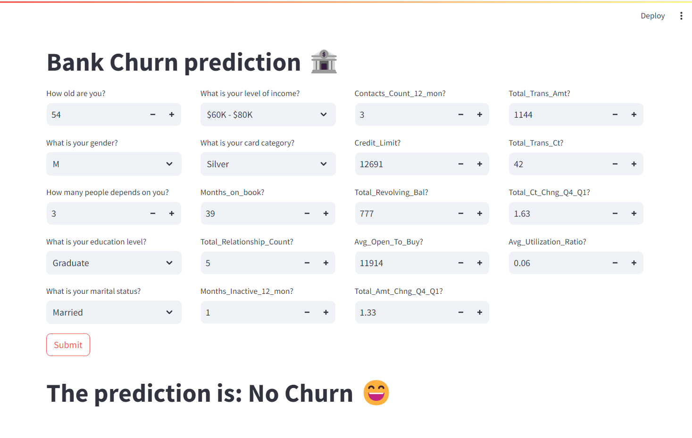
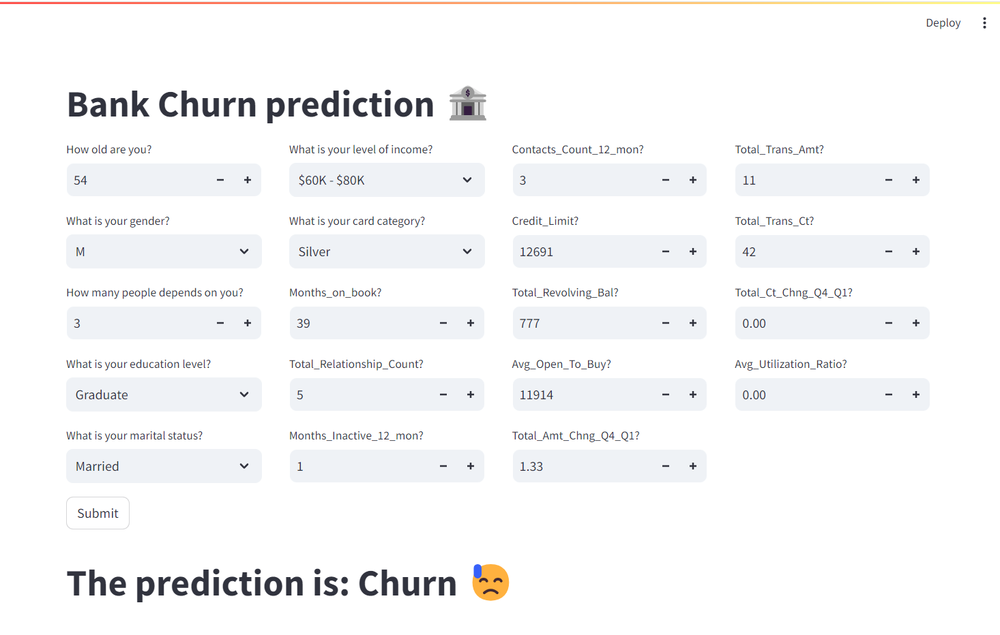

# Bank Churn Prediction Using Classical Machine Learning Models - AWS FARGATE

### Project Description:

This project aims to develop, train, and deploy a model that predicts bank customer churn. We will explore and compare the performance of various classical machine learning models like Logistic Regression, Random Forest, and XGBoost. MLflow will be used for model management, tracking, and deployment.

### Project Structure:

The project is divided into three microservices for better organization and scalability:

1. ml_bankchurn: This service handles data preparation, model training, and evaluation.
2. frontend: This service provides a user interface to interact with the model.
3. mlflow: This service tracks model experiments, facilitates model versioning, and enables model deployment.

### Examples

Example of no churn


Example of churn


## ml_bankchurn service

This is a Kedro project, which was generated using `Kedro 0.19.2`.

Take a look at the [Kedro documentation](https://kedro.readthedocs.io) to get started.

The project is devided in two pipelines

1. data_processing: It performes steps like: remove unnecesary columns, handle outliers, treat skewed columns, one hot encoding and feature selection
2. data_science: It performes steps like: split data, train and evaluate model

### How to install dependencies

Create an environment and make sure that it is with python 3.9

How to install and run project with poetry:

```
pip install poetry
poetry install --without dev
poetry shell
poetry run python -m uvicorn --port 8000 data_science_bank_churn.src.app:app
```

### How to run Kedro project

If we want to run all the processing and training steps, run:

```
kedro run
```

If we only want to run a specific pipeline run:

```
kedro run --pipeline=data_science
```

If we want to visualize the final results run:

```
kedro viz run --autoreload
```

# Model Deployment with AWS Fargate

## 1. Validate docker images

```
docker build -t bankchurn .

docker run -it -p 8000:8000 bankchurn
```

## 2. Create IAM user

## 3. Create ECR repository for each container

## 4. Creaet ECS cluster

## 5. Manually set task definition

## 6. Download task definition .json and save inside repository

## 7. Run task definition inside cluster

## 8. Configure credential in github actions

## 8. Configure aws.yml file forn github actions

# Model Deployment in EC2

## 1. Validate docker images

```
docker build -t bankchurn .

docker run -it -p 8000:8000 bankchurn
```

## 2. Create IAM user

## 3. Create ECR repository

## 4. Create EC2 instance

Can be ubuntu

## 5. Setup EC2 instance

```
#optinal

sudo apt-get update -y

sudo apt-get upgrade

#required

curl -fsSL https://get.docker.com -o get-docker.sh

sudo sh get-docker.sh

sudo usermod -aG docker ubuntu

newgrp docker

#In case of error
sudo chmod 666 /var/run/docker.sock

```

## 6. Create a runner in github

### Download

#### Create a folder

```
mkdir actions-runner && cd actions-runner# Download the latest runner package
curl -o actions-runner-linux-x64-2.313.0.tar.gz -L https://github.com/actions/runner/releases/download/v2.313.0/actions-runner-linux-x64-2.313.0.tar.gz
echo "56910d6628b41f99d9a1c5fe9df54981ad5d8c9e42fc14899dcc177e222e71c4 actions-runner-linux-x64-2.313.0.tar.gz" | shasum -a 256 -c
tar xzf ./actions-runner-linux-x64-2.313.0.tar.gz
```

### Configure

#### Create the runner and start the configuration experience

```
./config.sh --url https://github.com/luis95garay/data_science_bank_churn --token A2HZ3RAIEHR54EP7JI4PWY3F2JIFM
./run.sh
```

### Using your self-hosted runner

The name must be self-hosted

## 7. Create github credentials

AWS_ACCESS_KEY_ID=

AWS_SECRET_ACCESS_KEY=

AWS_REGION = us-east-1

AWS_ECR_LOGIN_URI = demo>> id.dkr.ecr.us-east-1.amazonaws.com

ECR_REPOSITORY_NAME = bankchurn

## 7. Add and push the github workflow

## 8. Update security group

Add custom TCP in port 8000

## 9. Display in EC2

Remember to replace https to http

## 10. Clean resources

- Delete app runner
- Terminate EC2
- Delete ECR repository
